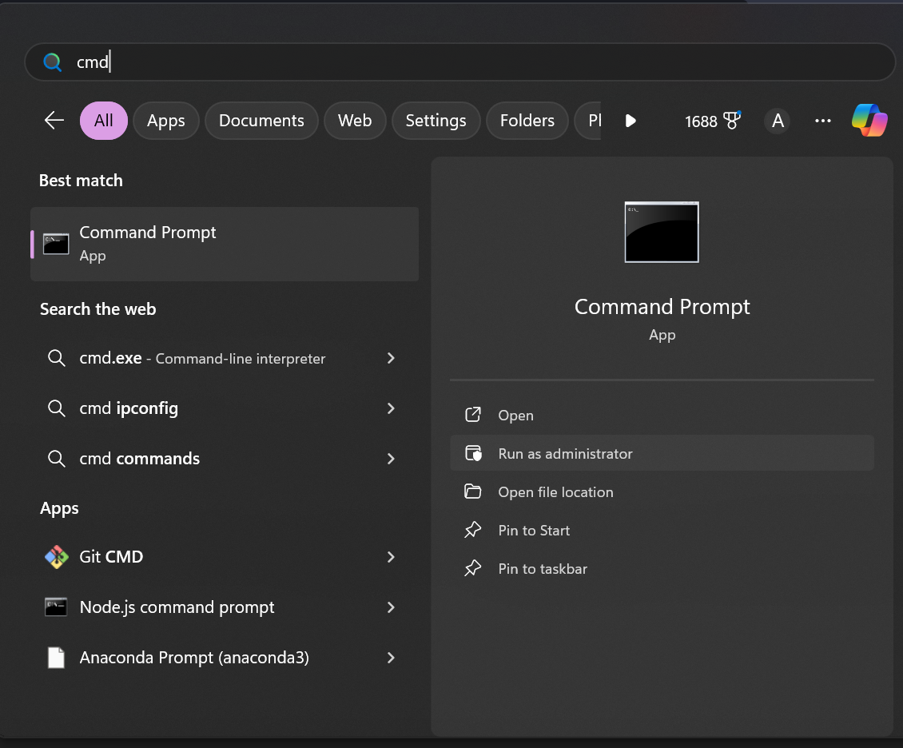

<!--StartFragment-->

Installing software can be time-consuming. You have to search for the program, download it, and then manually install it, often with unwanted packages bundled in.

To skip these steps, try Chocolatey. It's a command-line package manager for Windows that makes software management easier. It can install, upgrade, remove, and configure applications, saving you time.

To install and set up Chocolatey on Windows, follow these steps:

## **1. Open CMD as Admin :**



## **2.** **Install Chocolatey**:

Run the following command in the command prompt:

```cmake
@"%SystemRoot%\System32\WindowsPowerShell\v1.0\powershell.exe" -NoProfile -InputFormat None -ExecutionPolicy Bypass -Command "iex ((New-Object System.Net.WebClient).DownloadString('https://chocolatey.org/install.ps1'))" && SET "PATH=%PATH%;%ALLUSERSPROFILE%\chocolatey\bin"
```

## **3. Verify Installation:**


## **4. Usage:**

Let's install GoogleChrome using Chocolatey.


If you are unsure about package name, you can check that in
[<span style="color:orange">`https://community.chocolatey.org/packages`</span>](https://community.chocolatey.org/packages)

If you want a window interface instead of the powershell console, you can do: `choco install chocolateygui`.

## Cheat Sheet

Unlock the full potential of Chocolatey (Choco) with this comprehensive cheatsheet, packed with essential commands and shortcuts to supercharge your software management experience.

### Usage

| Command                                                     | Description                            |
| ----------------------------------------------------------- | -------------------------------------- |
| [list](https://chocolatey.org/docs/commands-list)           | lists remote or local packages         |
| [search](https://chocolatey.org/docs/commands-search)       | searches remote or local packages      |
| [info](https://chocolatey.org/docs/commands-info)           | retrieves package information          |
| [install](https://chocolatey.org/docs/commands-install)     | installs packages from various sources |
| [pin](https://chocolatey.org/docs/commands-pin)             | pins a package to suppress upgrades    |
| [outdated](https://chocolatey.org/docs/commands-outdated)   | retrieves packages that are outdated   |
| [upgrade](https://chocolatey.org/docs/commands-upgrade)     | upgrades packages from various sources |
| [uninstall](https://chocolatey.org/docs/commands-uninstall) | uninstalls a package                   |

See also the [Chocolatey Command Reference](https://chocolatey.org/docs/commands-reference) for a complete list.

### Examples

| Command                                        | Description                                      |
| ---------------------------------------------- | ------------------------------------------------ |
| **Find a package**                             |                                                  |
| `choco list`                                   | List all chocolatey packages                     |
| `choco search zip`                             | Search packages mentionning "zip"                |
| `choco search --by-tag compression`            | Search packages by their tags                    |
| `choco search --by-id-only zip`                | Search packages with "zip" in the package name   |
| `choco search --order-by-popularity zip`       | Filter and sort by package results by popularity |
| `choco search --approved-only zip`             | Only return approved packages                    |
| `choco info 7zip`                              | Get information about 7zip package               |
|                                                |                                                  |
| **Install**                                    |                                                  |
| `choco install 7zip`                           | Install                                          |
| `choco install 7zip --install-directory=P:\7z` | Install to a specific directory                  |
|                                                |                                                  |
| **Maintenance**                                |                                                  |
| `choco list --localonly`                       | List installed packages                          |
| `choco outdated`                               | List upgradable packages                         |
| `choco upgrade all -y`                         | Upgrade all packages                             |
|                                                |                                                  |
| **Pinning**                                    |                                                  |
| `choco pin list`                               | List pinned packages                             |
| `choco pin add --name 7zip`                    | Suppress upgrades for 7zip                       |
| `choco pin remove --name 7zip`                 | Supress upgrades supression for 7zip ;)          |

Prefered search method: `choco search --by-id-only --order-by-popularity --approved-only` searchstring

### Other Command line switches

| Switches                    | Description                                           |
| --------------------------- | ----------------------------------------------------- |
| `--help`                    | Prints out the help menu.                             |
|                             |                                                       |
| `--install-directory=VALUE` | Install Directory Override                            |
|                             |                                                       |
| `-y`, `--yes`               | Confirm all prompts.                                  |
| `-f`, `--force`             | Force the behavior.                                   |
| `--what-if`                 | Don't actually do anything, simulate.                 |
|                             |                                                       |
| `--execution-timeout=VALUE` | The time to allow a command to finish.                |
| `--fail-on-standard-error`  | Fail on standard error output (stderr).               |
| `--use-system-powershell`   | Execute PowerShell using an external process.         |
|                             |                                                       |
| `--debug`                   | Show debug messaging.                                 |
| `--verbose`                 | Show verbose messaging.                               |
| `--trace`                   | Show trace messaging.                                 |
| `--log-file=VALUE`          | Log File to output to in addition to regular loggers. |
|                             |                                                       |
| `--no-color`                | Do not show colorization in output.                   |
| `--limit-output`            | Limit the output to essential information.            |
| `--no-progress`             | Do not show download progress percentages.            |
|                             |                                                       |
| `--allow-unofficial-build`  | Allow the use of an unofficial build.                 |

So why wait? Dive into the world of Chocolatey today and revolutionize the way you manage software on Windows. Say goodbye to manual installations and hello to a faster, more streamlined approach with Chocolatey. Your software management journey starts here!

<!--EndFragment-->
